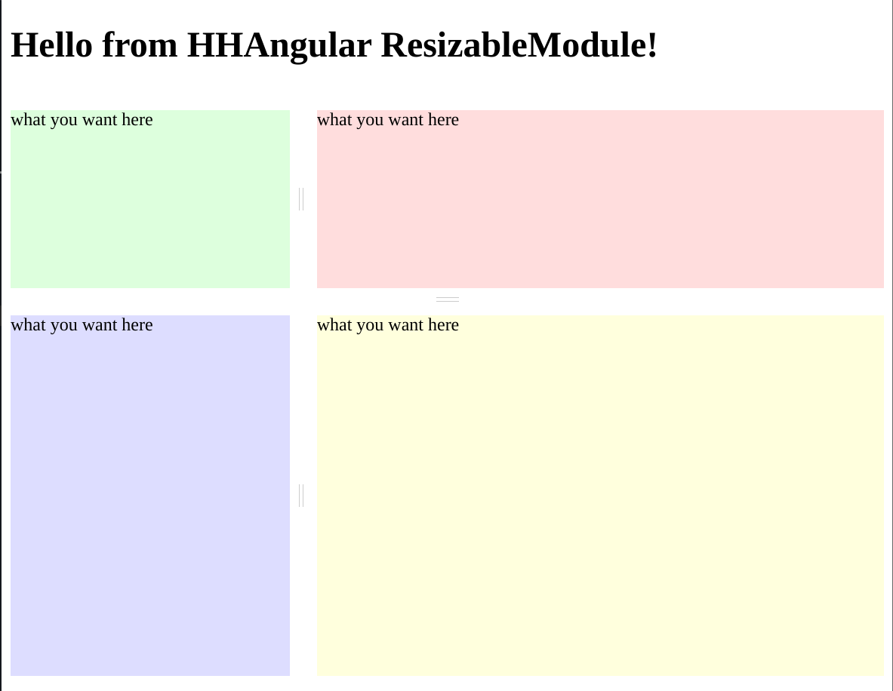

# Resizable 

[](https://github.com/hhangular/resizable/actions/workflows/main.yml)

[](https://github.com/hhangular/resizable/actions/workflows/tag.yml)

[](https://badge.fury.io/js/@hhangular%2Fresizable)

## Overview
This project was generated with [Angular CLI](https://github.com/angular/angular-cli) version 16.2.1.

You can read how [here](https://angular.io/guide/creating-libraries)

## Resize your panel component effortlessly

This library contains an angular module `ResizableModule` that allows you to resize easily panel.   

# Demo




[stackblitz](https://stackblitz.com/edit/hhangular-resizable?file=src%2Fmain.ts)

### Peer dependence

No dependency

## Directive

 - **resizable** is a `directive` to annotate an element that you want resize.   

 ```html
 <div style="display: flex; flex-direction: row">
  <div resizable [percent]="33">
    <!-- What you want here -->
  </div>
  <div resizable [percent]="67">
    <!-- What you want here -->
  </div>
 </div>
 ```

## Installation

For help getting started with a new Angular app, check out the [Angular CLI](https://cli.angular.io/).

For existing apps, follow these steps to begin using `@hhangular/resizable` in your Angular app.

## Install @hhangular/resizable

You can use either the npm or yarn command-line tool to install the `package`.    
Use whichever is appropriate for your project in the examples below.

### NPM

```bash
# @hhangular/resizable
npm install @hhangular/resizable --save 
```

### YARN

```bash
# @hhangular/resizable
yarn add @hhangular/resizable
```

## Configuration

Just import the module `ResizableModule` and you can use the `directive`.   
You can do this in your `AppModule` or in your `SharedModule` indifferently.

`AppModule.ts`
```typescript
import {NgModule} from '@angular/core';
import {BrowserModule} from '@angular/platform-browser';
import {CommonModule} from '@angular/common';
import {HttpClientModule} from '@angular/common/http';
import {AppComponent} from './app.component';
// ================= IMPORT =================
import {ResizableModule} from '@hhangular/resizable';

@NgModule({
  declarations: [
    AppComponent,
  ],
  imports: [
    BrowserModule,
    CommonModule,
    HttpClientModule,
// ================= IMPORT =================
    ResizableModule,
  ],
  bootstrap: [AppComponent],
  providers: []
})
export class AppModule {
}
```

--- 

`SharedModule.ts`
```typescript
import {CommonModule} from '@angular/common';
import {NgModule} from '@angular/core';
// ================= IMPORT =================
import {ResizableModule} from '@hhangular/resizable';

@NgModule({
  imports: [
    CommonModule,
// ================= IMPORT =================
    ResizableModule,
  ],
  exports: [
// ================= EXPORT =================
    ResizableModule,
  ],
  declarations: [],
})
export class SharedModule {
}
```

# Use

The use of 'Directive': `resizable` is very simple.

## Use cases
You want to split your UI in different area resizable

---

In a component template just decorate a div (or other) as follows:

```html
 <div style="display: flex; flex-direction: column">
  <div style="display: flex; flex-direction: row">
    <div resizable [percent]="33">
      <!-- What you want here -->
    </div>
    <div resizable [percent]="67">
      <!-- What you want here -->
    </div>
  </div>
  <div style="display: flex; flex-direction: row">
    <div resizable [percent]="33">
      <!-- What you want here -->
    </div>
    <div resizable [percent]="33">
      <!-- What you want here -->
    </div>
    <div resizable [percent]="33">
      <!-- What you want here -->
    </div>
  </div>
</div>
```

The container flex direction set the resizable direction

## Inputs

```html
<div resizable [percent]="33" min="200px" max="50%">
```

| name | description | type | sample |
|---|---|---|---|
| percent | The initial percent size | number | 33 |
| min | The minimal size of panel in % or px | string | 200px or 20% |
| max | The maximum size of panel in % or px | string | 500px or 30% |


## Outputs

```html
<div resizable [percent]="33" (percentChange)="percentChangeHandler($event)">
```

| name | description | type | sample |
|---|---|---|---|
| percentChange | The percent size | number | 33.333 |

